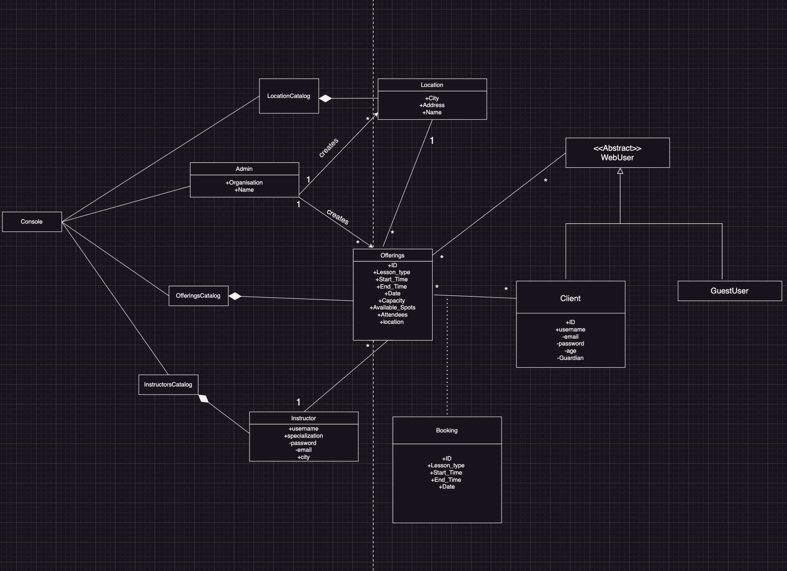
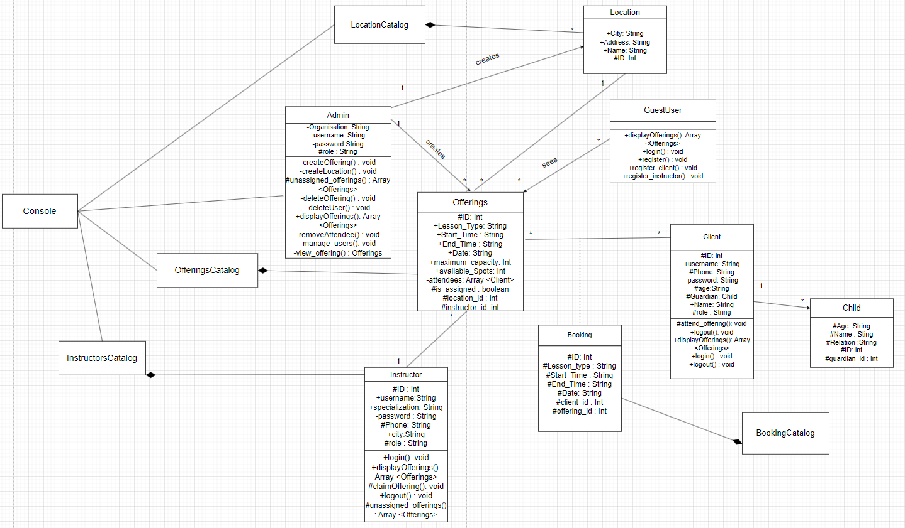
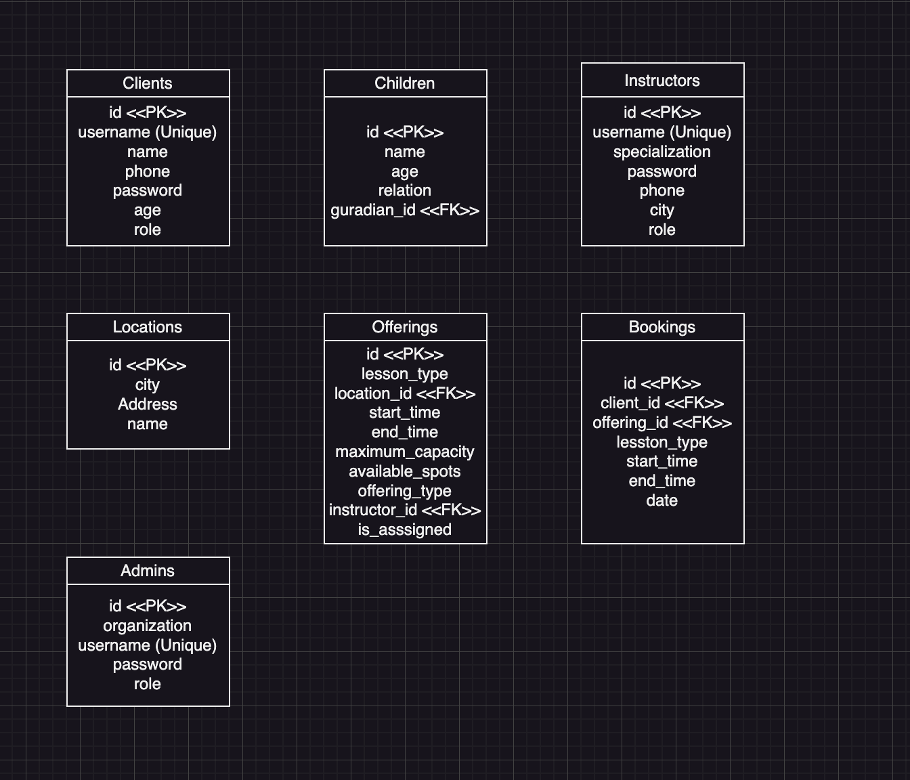

# SOEN342 Project

### Antoine Mansour (40250454) Section H
### Sadee Mohammad Shadman (40236919) Scetion H    

---

#### Use Case UML:    

      


#### Domain Model:

  

#### Class Diagram:

  


#### Package Diagram:

     


System Sequence Diagram of Administrator:

         


System Sequence Diagram of Instructors:

      


System Sequence Diagram of Clients:

          

---    


### Operation Contracts


#### 1. `login`

**Operation**: `login(adminCredentials)`    
**Cross reference**: Use Case Process Offerings

- **Preconditions**:  
  - The `Administrator’s` credentials must exist in the system.

- **Postconditions**:  
  - If valid, the `Administrator` is authenticated and logged in.
  - If invalid, an error message is shown.

---

#### 2. `create_offering`

**Operation**: `createOffering()`    
**Cross reference**: Use Case Process Offerings

- **Preconditions**:  
  - The `Administrator` is logged in.
  - The `offering` details must include valid detals.
  
- **Postconditions**:  
  - If the `offering` is unique (checked by `checkOfferingUniqueness`), the system creates the new offering.
  - If the `offering` is not unique, the system returns an error message.

---     

#### 3. `checkOfferingUniqueness`

**Operation**: `checkOfferingUniqueness(offeringDetails)`    
**Cross reference**: Use Case Process Offerings

- **Preconditions**:  
  - The system has received a valid offering submission from the `administrator`.

- **Postconditions**:  
  - The system confirms that no offering already exists at the same location, date, and time slot.
  - If no conflict is found, it proceeds to confirm the creation.
  - If a conflict is found, it returns an error message to the `administrator`.

---

#### 4. `viewAvailableOfferings`

**Operation**: `viewAvailableOfferings()`     
**Cross reference**: Use Case Process Offerings

- **Preconditions**:  
  - The `Instructor` is authenticated and logged in.

- **Postconditions**:  
  - The system returns a list of all available `offerings` (those that have not been selected by other instructors).

---

#### 5. `claim_offering`

**Operation**: `selectOffering(offeringId)`     
**Cross reference**: Use Case Process Offerings

- **Preconditions**:  
  - The `Instructor` is authenticated and logged in.
  - The `offering` must be available (not yet selected by another instructor).

- **Postconditions**:  
  - The selected `offering` is now associated with the `instructor`.
  - The `offering` is marked as unavailable for other `instructors`.

--- 

Interaction Diagram of Create Location (Admin):

    
   
     
Interaction Diagram of Create Offering (Admin):

      


Interaction Diagram of Book (Client):

   


Interaction Diagram of Accept Offering (Instructor):

       

   
Interaction Diagram of Remove Attendee (Admin):

      


Interaction Diagram of Register (Guest User):

   
  

Relational Data Model:
  


#### Requirement 1:   
“Offerings are unique. In other words, multiple offerings on the same day and time slot must be offered at a different location.”

```
context Offering
inv UniqueOfferingsByLocation:
    Offering.allInstances()->forAll(o1, o2 |
        o1 <> o2 implies
        (o1.start_time <> o2.start_time or o1.end_time <> o2.end_time or o1.date <> o2.date or o1.location_id <> o2.location_id)
    )
```
#### Requirement 2:   
“Any client who is underage must necessarily be accompanied by an adult who acts as their guardian.”
```
context Booking
inv UnderageBooking:
    -- Ensure that only adult clients (age >= 18) can make a booking
    self.client.age >= 18
```
#### Requirement 3:  
“The city associated with an offering must be one the city’s that the instructor has indicated in their availabilities.”

```
context Offering
inv CityMatchesInstructorAvailability:
    let offeringCity : String = self.location.city in
        Instructor.allInstances()->exists(instructor |
            instructor.id = self.instructor_id and
            instructor.city = offeringCity)

```
#### Requirement 4:
“A client does not have multiple bookings on the same day and time slot.” (for simplicity we consider only identical day and time slots, even though in reality a booking on Monday 3pm – 4pm and another also on Monday 3:30pm – 4:30pm should not be acceptable.)
```
context Booking
inv NoMultipleBookingsForSameClientAndTime:
    Booking.allInstances()->forAll(b1, b2 |
        b1 <> b2 implies
        (b1.client_id <> b2.client_id or b1.start_time <> b2.start_time or b1.end_time <> b2.end_time or b1.date <> b2.date)
    )
```

