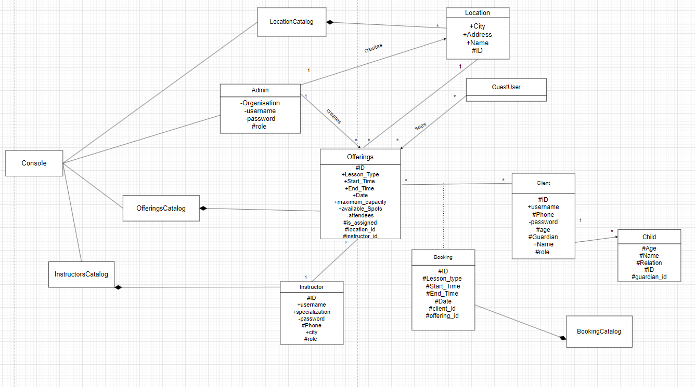

# SOEN342 Project

### Antoine Mansour (40250454) Section H
### Sadee Mohammad Shadman (40236919) Section H    

Video : https://www.youtube.com/watch?v=u0fEbt3YS5w
---

## Getting Started

To set up and start the application, follow these steps:

1. **Clone the repository**:
   ```bash
   git clone https://github.com/antoinemansour7/SOEN342.git
   cd SOEN342

2. **Set up a virtual environment (recommended)**:
    ```bash
    python3 -m venv venv
    source venv/bin/activate  # On Windows: venv\Scripts\activate

3. **Install dependencies**:
    ```bash
    pip install -r requirements.txt

4. **Set up the database**:
    ```bash
    flask db init
    flask db migrate
    flask db upgrade

5. **Run the application**:
    ```bash
    flask run

The app will be available at http://127.0.0.1:5000.

6. **Login credentials** :
Admin username: admin
Admin password: adminpassword


---
**Concurrency Management with Locks**

To ensure data consistency and thread safety, we implemented reader-writer locks using Python's threading.Lock. Critical operations, such as creating offerings, creating locations, and attending offerings, are protected with locks to prevent race conditions.

Writer Locks: Used in routes like create_offering and create_location to ensure only one Admin can modify shared resources (e.g., the database and in-memory catalogs) at a time.
Reader and Writer Locks: Used in attend_offering to allow multiple clients to read offering details simultaneously, while ensuring only one client can update booking details at a time.
This approach ensures consistency and prevents conflicting updates during concurrent user actions.


---

### Use Case UML:    

      


### Domain Model:

  

### Class Diagram:

  


### Package Diagram:

     


### System Sequence Diagrams:
System Sequence Diagram of Administrator:

         


System Sequence Diagram of Instructors:

      


System Sequence Diagram of Clients:

          

---    


### Operation Contracts:


#### 1. `login`

**Operation**: `login(username, password)`    
**Cross reference**: Use Case Process Offerings, Use Case Process Bookings

- **Preconditions**:  
  - The credentials must exist in the system.

- **Postconditions**:  
  - If valid, the `setRole` method sets the role of the user as either an `admin`, `instructor` or `client`.
  - If valid, the user with the role is authenticated into the system
  - If invalid, an error message is shown.

---

#### 2. `create_location`

**Operation**: `create_location(city, address, location)`    
**Cross reference**: Use Case Process Offerings

- **Preconditions**:  
  - The `Administrator` is logged in.
  - The `location` details must include valid detals.
  
- **Postconditions**:  
  - If the `location` is unique (checked by `checkLocationUniqueness()`) with valid details, the system creates the new offering.
  - If the `location` is not unique or has invalid details, the system returns an error message.
 
--- 

#### 3. `create_offering`

**Operation**: `create_offering(lessonType, offeringType, startTime, endTime, date, maxCapacity)`    
**Cross reference**: Use Case Process Offerings

- **Preconditions**:  
  - The `Administrator` is logged in.
  - The `offering` details must include valid detals.
  
- **Postconditions**:  
  - If the `offering` is unique (checked by `checkOfferingUniqueness`) with valid details, the system creates the new offering.
  - If the `offering` is not unique or has invalid details, the system returns an error message.

---

#### 4. `delete_offering`

**Operation**: `delete_offering(offering_id)`    
**Cross reference**: Use Case Process Offerings

- **Preconditions**:  
  - The `Administrator` is logged in.
  - The `offering` must exist in the catalog of offerings.
  
- **Postconditions**:  
  - The `offering` is deleted.
  - The `offering` is removed from the list of claimed offerings of the assigned instructor.
  - The `offering` is removed from the list of bookings of the participating clients.

---

#### 5. `remove_attendee`

**Operation**: `remove_attendee(offering_id, user_id)`    
**Cross reference**: Use Case Process Offerings, Use Case Process Bookings

- **Preconditions**:  
  - The `Administrator` is logged in.
  - The `client` must exist in the `offering`'s list of attendees.
  
- **Postconditions**:  
  - The `client` is removed from the list of attendees of the `offering`
  - The `offering` is removed from the list of bookings of the participating clients.
  - The `offering` is displayed with a capacity of 1 more than before.

---

#### 6. `delete_user`

**Operation**: `delete_user(user_id, user_type)`    
**Cross reference**: Use Case Process Offerings

- **Preconditions**:  
  - The `Administrator` is logged in.
  - The `user_id` of the selected `user_type` exists in the system
  
- **Postconditions**:  
  - The `user`'s profile is deleted.
  - If `user_type` was instructor, all claimed `offering` of the instructor is no more public (moved to unassignedOfferings to be claimed)
  - If `user_type` was client, all attending `offering` from `booking` of the client is removed and displayed with a capacity of 1 more than before.

---

#### 7. `diaplayUnassignedOfferings`

**Operation**: `diaplayUnassignedOfferings()`     
**Cross reference**: Use Case Process Offerings

- **Preconditions**:  
  - The `admin` or `Instructor` is authenticated and logged in.

- **Postconditions**:  
  - If there exists, the system returns a list of all available `offerings` (those that have not been claimed by an instructor).
  - If there are no unassigned `offerings`, an empty page is shown.

---

#### 8. `claim_offering`

**Operation**: `claim_offering(offering_id)`     
**Cross reference**: Use Case Process Offerings

- **Preconditions**:  
  - The `Instructor` is authenticated and logged in.
  - The `offering` must be available (found by `diaplayUnassignedOfferings()`).
  - The `offering` schedule must not conflict with another claimed offering's schedule of the instructor.
  - The `offering` city and lessonType must match the `Instructor` city and speciality that they are available to work in.

- **Postconditions**:  
  - The selected `offering` is now associated with the `instructor`.
  - The `offering` is removed from the list of unassigned offerings.
  - The `offering` is public and anyone can see it or attend it.

---       

#### 9. `displayOfferings`

**Operation**: `dispplayOfferings()`     
**Cross reference**: Use Case Process Offerings, Process Bookings

- **Preconditions**:  
  - An `offering` has been claimed by an instructor. 

- **Postconditions**:  
  - The list of `offerings` claimed by instructors are displayed to the user (guest or registered).

---

#### 10. `attend_offering`

**Operation**: `attend_offering(offering_id)`     
**Cross reference**: Use Case Process Bookings

- **Preconditions**:  
  - The `Client` is authenticated and logged in.
  - The `Client` has selected the person to book the offering for (themselves or a child that they will accompany)
  - The `offering` must have available capacity.
  - The `offering`'s startTime and endTime must not conflict with another scheduled booking of the `Client`. 

- **Postconditions**:  
  - The selected `offering` is now booked by the `Client`.
  - The `offering` is displayed with a capacity of 1 less than before.
  - The `offering` and its details are now available under `bookings` of the `Client`.

---

#### 11. `view_your_bookings`

**Operation**: `view_your_bookings()`     
**Cross reference**: Use Case Process Bookings

- **Preconditions**:  
  - The `Client` is authenticated and logged in.

- **Postconditions**:  
   - If there exists, the system returns a list of all available `bookings` (those that have been selected `attend_offering` by the client).
   - If there are no `offerings` that have been selected `attend_offering`, an empty array is shown.

--- 

### Interaction Diagrams:

Interaction Diagram of Create Location (Admin):

    
   
     
Interaction Diagram of Create Offering (Admin):

      


Interaction Diagram of Delete Offering (Admin):

   


Interaction Diagram of Book (Client):

   


Interaction Diagram of Claim Offering (Instructor):

       

   
Interaction Diagram of Remove Attendee (Admin):

      


Interaction Diagram of Register (Guest User):

      


Interaction Diagram of Display Offerings (User):

    


Interaction Diagram of Display Unassigned Offerings (Admin, Instructor):

     


Interaction Diagram of Display Bookings (Client):

    


Interaction Diagram of Delete User (Admin):

 
  

### Relational Data Model:
  


### OCL Requirements:
      
#### Requirement 1:   
“Offerings are unique. In other words, multiple offerings on the same day and time slot must be offered at a different location.”

```
context Offering
inv UniqueOfferingsByLocation:
    Offering.allInstances()->forAll(o1, o2 |
        o1 <> o2 implies
        (o1.start_time <> o2.start_time or o1.end_time <> o2.end_time or o1.date <> o2.date or o1.location_id <> o2.location_id)
    )
```
#### Requirement 2:   
“Any client who is underage must necessarily be accompanied by an adult who acts as their guardian.”
```
context Booking
inv UnderageBooking:
    self.client.age >= 18
```
#### Requirement 3:  
“The city associated with an offering must be one the city’s that the instructor has indicated in their availabilities.”

```
context Offering
inv CityMatchesInstructorAvailability:
    Instructor.allInstances()->exists(instructor |
        instructor.id = self.instructor_id and
        instructor.city = self.location.city)

```
#### Requirement 4:
“A client does not have multiple bookings on the same day and time slot.” (for simplicity we consider only identical day and time slots, even though in reality a booking on Monday 3pm – 4pm and another also on Monday 3:30pm – 4:30pm should not be acceptable.)
```
context Booking
inv NoMultipleBookingsForSameClientAndTime:
    Booking.allInstances()->forAll(b1, b2 |
        b1 <> b2 implies
        (b1.client_id <> b2.client_id or b1.start_time <> b2.start_time or b1.end_time <> b2.end_time or b1.date <> b2.date)
    )
```

